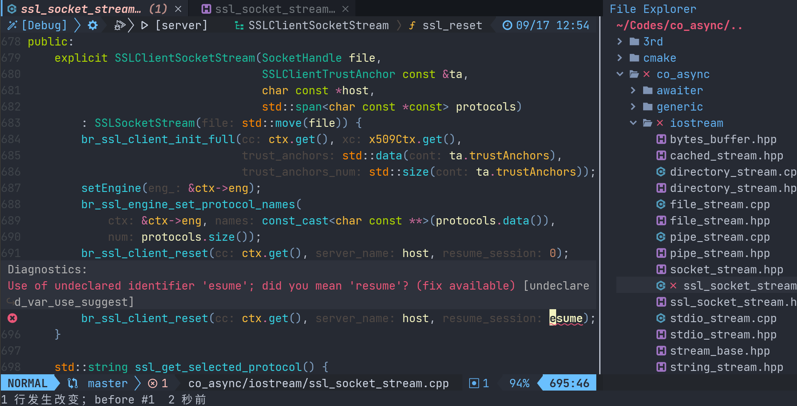

# 小彭老师自用 NeoVim 整合包

本整合包内含大量实用插件，包括智能补全、语法高亮、错误提示、快速跳转、全局搜索、集成终端、文件浏览、Git 支持等。且安装方便，小彭老师自用同款，纯 Lua 配置，是您基于 NeoVim 的 IDE 不二之选。



## 一键安装（推荐）

无需克隆本仓库，直接在命令行中输入以下命令即可安装：

```bash
curl -SLf https://142857.red/files/nvimrc-install.sh | bash
```

如果安装遇到问题，欢迎通过 [GitHub issue](github.com/archibate/vimrc/issues) 反映，我会尽快帮您解决。

* 目前只支持 Linux 和 MacOS 系统，暂不支持 Wendous 系统。
* 请勿以 root 身份运行！否则会为 root 安装 nvim 插件而不是当前用户，插件安装后仅对当前用户有效。
* 您的系统中无需事先安装有 nvim，本整合包内部已经自带了最新版 nvim 的 AppImage，可无依赖直接运行。
* 无需连接 GitHub，所有插件全部已经预下载在整合包内部，无需 GitHub 加速器！
* 过程中会通过您系统的包管理器安装一些工具，所以只需确保包管理器的设置是国内源即可。
* 为了能够使用补全，会为您安装如 clangd 一类的包，但即使其中一个安装失败，也不影响其他语言和编辑器整体的使用。
* 安装脚本运行中可能产生一些冗余错误信息，属于正常现象，不影响使用，请忽视他们。

安装完成后，输入 `nvim` 即可使用，按 `q` 或 `:wqa` 即可退出。

如需更新，重新执行上面的一键安装命令即可。

推荐为您的终端安装 [Nerd Fonts](https://www.nerdfonts.com/) 字体，并把终端设置为该字体。然后在 `nvim` 中输入 `:lua require'archvim.options'.nerd_fonts = true`，这样就可以显示文件类型图标了。

> 小彭老师用的是 JetBrainsMono Nerd Font Regular，字号 16，这是一款专为程序员打造的等宽字体。

如需自己定制插件参数、移除不想要的插件或添加更多插件：可以编辑 `~/.config/nvim/lua/archvim/plugins.lua`，里面有全部的插件列表，删除或添加即可。

> 注意：删除或添加了新插件后，需要运行 `:PackerSync` 和 `:PackerCompile` 命令才能生效。

### 常见问题

- Q: 不想要部分插件，或想安装其他插件？
- A: 修改 [`~/.config/nvim/lua/archvim/plugins.lua`](lua/archvim/plugins.lua) 中的 `plugins` 列表即可。

- Q: 不想要部分 LSP 服务器？
- A: 修改 [`~/.config/nvim/lua/archvim/config/mason.lua`](lua/archvim/config/mason.lua) 中的 `ensure_installed` 字段即可。

- Q: 不想要部分语法高亮？
- A: 修改 [`~/.config/nvim/lua/archvim/config/tree-sitter.lua`](lua/archvim/config/tree-sitter.lua) 中的 `ensure_installed` 字段即可。

- Q: 出现乱码，无法正确显示符号？
- A: 安装 [Nerd Font](https://www.cnblogs.com/zi-wang/p/12566898.html) 字体，并把终端设置为该字体。然后在 `nvim` 中输入 `:lua require'archvim.options'.nerd_fonts = true`，重启，这样以后就可以正确显示文件类型图标了。如果不喜欢，那就 `:lua require'archvim.options'.nerd_fonts = false` 关闭。

- Q: 打开 C/C++ 源码时不识别头文件目录，“飙红线”，怎么办？
- A: 请先在 NeoVim 中用 `:CMakeGenerate` 命令配置项目！否则无法识别你 CMake 里的编译选项。如果一定要命令行构建，请给 `cmake` 指定 `-DCMAKE_EXPORT_COMPILE_COMMANDS=ON` 参数，这样 C++ 补全才能正常工作，详见下方的 “C/C++/CMake 配置” 章节。

- Q: Inlay Hint 太烦太挡视线了！能否关闭？
- A: `:lua require'archvim.options'.enable_inlay_hint = false`，重启，即可永久关闭。如需暂时开启和关闭，可以用 `gsi` 快捷键。

- Q: 支持（非 Neo 的）Vim 吗？
- A: 本分支只有 NeoVim 配置，对于来自 BV1H44y1V7DW 视频想领取老版 Vim 插件的同学，请移步 [main 分支](https://github.com/archibate/vimrc/tree/main)。

### 支持的 Linux 发行版

- Arch Linux（亲测可用）
- Manjano Linux (群友测试可用)
- Ubuntu (亲测 20.04 可用)
- Debian (理论可行，没有测试过)
- Kali Linux (理论可行，没有测试过)
- Raspbian (理论可行，没有测试过)
- Fedora (感谢 @justiceeem 大佬)
- OpenSUSE (感谢 @sleeplessai 大佬)
- CentOS (感谢 @xxy-im 大佬)
- Deepin (感谢 @zhangasia 大佬)
- MacOS (感谢 @YangZ2020 测试确认)

## 开始上手

### 常用键位映射

`i` `j` `k` `c` `d` `w` 等 Vim 原生键位不再赘述，此处仅介绍本插件整合包额外增加或不同的。

以下默认读者知晓 Vim 的四大模式：普通模式（NORMAL）、插入模式（INSERT）、可视模式（VISUAL）、终端插入模式（TERMINAL）。

不同模式下有独立的键位映射，以下除非特殊说明，默认指的是普通模式下的映射。

#### 太长不看（简略版）

**基本**

- `jk` / `kj` / `<Esc>` 回到普通模式
- `q` / `:wq` / `ZZ` 保存并退出
- `Q` 记录宏

- `gl` / `$` 移动到行末尾
- `gh` / `^` 移动到行开头（不包括空格）
- `3gl` / `$2l` 移动到行末尾倒数第 3 个字符
- `3gh` / `^2h` 移动到行开头倒数第 3 个字符

**跳转**

- `gd` 跳转到定义
- `gD` 跳转到声明
- `gy` 跳转到变量类型的定义
- `gY` 跳转到虚函数实现
- `go` 头文件和源文件来回跳转

- `gr` 寻找符号引用
- `gz` 罗列所有相关信息（定义、引用等）

- `gf` 打开光标下的文件名
- `gF` 打开光标下的文件名并跳到右侧指定的行号
- `gx` 打开光标下的网页链接

- `<C-o>` 跳转回来

**重构**

- `gcc` 注释/取消注释当前选中的代码/行
- `gn` 重命名变量
- `gw` 尝试自动修复问题
- `g=` 自动格式化当前代码

**预览**

- `K` 悬浮窗查看文档
- `gsf` 预览函数定义
- `gsc` 预览类定义
- `gsd` 预览语法错误

**开关**

- `gso` 打开大纲
- `gsg` 打开 Git 面板
- `gsp` 打开项目文件树
- `gss` 查看所有静态语法错误
- `gsl` 查看所有编译器报错
- `gsi` 开关 Inlay Hint

**标签页**

- `<F4>` 或 `:wa` 一键保存所有打开的文件

- `<F3>` 或 `gt` 切换到下一个标签页
- `<F2>` 或 `gb` 切换到上一个标签页
- `<F1>` 或 `g<Tab>` 将当前标签页固定在最前

- `<S-F3>` 或 `gT` 将当前标签页右移一位
- `<S-F2>` 或 `gB` 将当前标签页左移一位
- `<S-F1>` 或 `g<BS>` 关闭当前标签页

- `<C-S-F3>` 或 `g<C-t>` 关闭右侧所有标签页
- `<C-S-F2>` 或 `g<C-b>` 关闭左侧所有标签页
- `<C-S-F1>` 或 `g<S-Tab>` 关闭除当前标签页外所有

- `g<Space>` 选择跳转到一个标签页

**文本查找**

- `,.` 当前文件中模糊查找
- `,k` 当前项目中正则表达式查找

- `,l` 当前项目中的所有文件
- `,b` 当前 Vim 已打开文件
- `,o` 最近打开过的历史文件

- `,i` 当前所有加入 Git 仓库的文件
- `,p` 当前 Git 有未提交修改的文件
- `,c` 所有 Git 提交历史
- `,v` 所有 Git 分支

- `,L` 当前项目所有加入 CMake 的 `.cpp` 源文件
- `,O` 当前项目所有 `CMakeLists.txt` 和 `.cmake` 文件

- `,x` 当前文件中所有符号
- `,j` 当前 Vim 跳转历史
- `,m` 所有 `m` 创建过的书签

- `,/` 历史 `/` 搜索记录
- `,:` 历史执行过的 Vim 命令
- `,;` 所有可用的 Vim 命令
- `,?` 所有 Vim 帮助文档

- `,a` 所有静态检查错误
- `,q` 所有编译器报错
- `,,` 多功能模糊查找

**选择**

- `vac` 选中当前类
- `vic` 选中当前类体内
- `vaf` 选中当前函数
- `vif` 选中当前函数体
- `vab` 选中当前块
- `vib` 选中当前块中内容
- `vad` 选中当前分支
- `vid` 选中当前分支块或条件
- `vae` 选中当前循环
- `vie` 选中当前循环体
- `vai` 选中当前函数调用语句
- `vii` 选中当前函数调用语句的参数列表
- `vap` 选中当前参数（包括空格和逗号）
- `vip` 选中当前参数（不包括空格和逗号）
- `vah` 选中当前赋值语句
- `vih` 选中当前赋值语句中的左侧值
- `var` 选中当前返回语句
- `vir` 选中当前返回语句返回值
- `vin` 选中当前数字
- `vat` 选中当前注释块

- `+` 扩大选择
- `-` 缩小选择

举一反三：`dat` 删除当前注释块，`cip` 修改当前参数

**移动**

- `]c` 下一个类开头
- `[c` 上一个类开头
- `]C` 下一个类结尾
- `[C` 上一个类结尾

- `]f` 下一个函数开头
- `[f` 上一个函数开头
- `]F` 下一个函数结尾
- `[F` 上一个函数结尾

...以此类推，所有英文字母同上“选择”所述...

- `<Space>` 全屏任意移动

**换位**

- `mh` 左移参数
- `ml` 右移参数
- `mj` 下移当前语句
- `mk` 上移当前语句
- `maf` 下移当前函数
- `mif` 上移当前函数
- `mac` 下移当前类
- `mic` 上移当前类

**括号**

可视（VISUAL）模式中：

- `s)` 给当前选中内容包上 `(选中内容)` 括号
- `s}` 给当前选中内容包上 `{选中内容}` 括号
- `s]` 给当前选中内容包上 `[选中内容]` 括号
- `s>` 给当前选中内容包上 `<选中内容>` 尖括号
- `s'` 给当前选中内容包上 `'选中内容'` 单引号
- `s"` 给当前选中内容包上 `"选中内容"` 双引号
- `stspan` 给当前选中内容包上 `<span>选中内容</span>` 标签
- `sta href="b.html"` 给当前选中内容包上 `<a href="b.html">选中内容</a>` 标签

普通（NORMAL）模式中：

- `ysi<range><brace>` 添加括号
- `cs<oldbrace><newbrace>` 改变括号
- `ds<brace>` 删除括号

<!-- 例如光标停在 `world` 上： -->
<!--  -->
<!-- ```cpp -->
<!-- hello world -->
<!-- ``` -->
<!--  -->
<!-- 按下 `viws"` 或 `ysiw"` -->
<!--  -->
<!-- ```cpp -->
<!-- hello "world" -->
<!-- ``` -->
<!--  -->
<!-- 按下 `cs")` -->
<!--  -->
<!-- ```cpp -->
<!-- hello (world) -->
<!-- ``` -->
<!--  -->
<!-- 按下 `ds)` -->
<!--  -->
<!-- ```cpp -->
<!-- hello world -->
<!-- ``` -->

**窗口**

- `<C-q>` 关闭当前窗口

- `<C-h>` 移动到当前左侧的窗口
- `<C-j>` 移动到当前下方的窗口
- `<C-k>` 移动到当前上方的窗口
- `<C-l>` 移动到当前右侧的窗口

- `<M-h>` 将当前窗口向左移动
- `<M-j>` 将当前窗口向下移动
- `<M-k>` 将当前窗口向上移动
- `<M-l>` 将当前窗口向右移动

- `<M-s>` 横向切割当前窗口，变为上下两个
- `<M-v>` 纵向切割当前窗口，变为左右两个

- `<M-=>` 将当前窗口高度增加 1 格
- `<M-->` 将当前窗口高度减少 1 格
- `<M-.>` 将当前窗口宽度增加 1 格
- `<M-,>` 将当前窗口宽度减少 1 格

<!-- **功能窗** -->
<!--  -->
<!-- - `<F12>` 打开大纲 -->
<!-- - `<F10>` 打开 Git 面板 -->
<!-- - `<F9>` 打开实时语法检查清单 -->
<!-- - `<F8>` 打开内置终端 -->
<!-- - `<F7>` 打开项目文件树 -->
<!-- - `<F6>` 打开编译器错误列表 -->
<!-- - `<F5>` 运行当前目录下的 `./run.sh` -->
<!-- - `<S-F5>` 中断当前在终端中执行的程序（发送 Ctrl+C） -->

**CMake 项目**

- `cmc` 或 `:CMakeGenerate` 配置当前项目
- `cmb` 或 `:CMakeBuild` 构建当前项目

- `cmr` 或 `:CMakeRun` 运行当前项目
- `cms` 或 `:CMakeStopRunner` 杀死当前终端中的正在运行的程序

- `:CMakeSelectBuildDir` 选择构建目录
- `:CMakeSelectBuildType` 选择构建类型（`Release` 或 `Debug`）
- `:CMakeSelectLaunchTarget` 选择以后 `:CMakeRun` 要运行的目标

**内置终端**

- `<F8>` 或 `<C-t>` 打开/关闭终端
- `<Esc>` 从终端模式（TERMINAL）中回到普通模式（NORMAL）
- `p` 粘贴剪贴板中的命令
- `i` 或 `a` 从普通模式回到终端模式

**文件树

- `y` 拷贝
- `x` 剪切
- `d` 删除
- `p` 粘贴
- `a` 创建

### C/C++/CMake 配置

建议使用本插件自带的 `cmake-tools` 插件的 `:CMakeGenerate` 和 `:CMakeBuild` 命令来构建项目。

这样是无需任何配置，所有 `CMakeLists.txt` 中配置的头文件都能找得到，语法高亮和代码提示就是正确的。

如果你想要手动命令行调用 `cmake`，那么也请指定 `-DCMAKE_EXPORT_COMPILE_COMMANDS=ON` 参数：

```bash
cmake -B build -DCMAKE_EXPORT_COMPILE_COMMANDS=ON
```

这会生成对 C++ 代码补全必不可少的 `build/compile_commands.json` 文件。

否则，本插件的语法高亮和代码提示插件将无法确定头文件目录，语法检测可能无法正常工作（俗称“飙红线”）。

> `:CMakeGenerate` 实际上就是默认自带了 `-DCMAKE_EXPORT_COMPILE_COMMANDS=ON` 这个参数，建议始终通过 `:CMakeGenerate` 和 `:CMakeBuild` 来构建项目。

如果你用的是其他构建系统，可能需要自己在项目根目录下生成 `compile_commands.json` 文件。

如需指定没有 `compile_commands.json` 时默认的 Clangd 选项（单文件编译的情况），编辑文件 [`~/.config/clangd/config.yaml`](dotfiles/.config-clangd-config.yaml)，内容为：

```yaml
CompileFlags:
  Add:
    - --no-cuda-version-check
    - -D__clangd__  # 添加你的自定义选项
  Remove:
    - -forward-unknown-to-host-compiler
    - --expt-*
    - -gencode*
    - --generate-code*
    - -Xfatbin*
    - -arch=*
    - -rdc=*
```

## 内含插件列表

完整插件列表，请查看 [`lua/archvim/plugins.lua`](lua/archvim/plugins.lua)，你可以编辑该文件，从而修改配置或添加新的插件。

### 语法高亮支持

```
c,cpp,cuda,cmake,lua,python,html,javascript,css,json,bash,regex,markdown,glsl,vim,vimdoc
```

你可以输入 `:TSInstall <language>` 来安装更多语言的语义高亮支持。

### 用于代码补全的 LSP 服务器

```
clangd,pyright,lua_ls
```

可以通过执行 `:Mason` 或修改 [`lua/archvim/config/lspconfig.lua`](lua/archvim/config/lspconfig.lua) 来安装更多语言的 LSP 补全支持。

### 脚本会创建或修改的文件

```
/usr/bin/nvim
/usr/bin/.nvim.appimage.noextract
~/.config/nvim
~/.local/share/nvim
~/.config/clangd
~/.clang-format
```

* 如果脚本发现您已经存在 `~/.config/nvim` 目录，则会将其备份至 `~/.config/.nvim.backup.随机数字`。
* 如果脚本发现您已经存在 `/usr/bin/nvim` 可执行文件，但版本不足 v0.10.0，则会用本整合包内置的 nvim.AppImage 替换他。
* 请勿以 sudo 模式运行本脚本，本脚本内部自动会在需要时采取 sudo。

> 欲了解本整合包安装与打包原理，请看 [`.compile.sh`](.compile.sh)。

## 手动安装（不推荐）

如果你有稳定的 GitHub 外网连接，并且已经自己安装好了 NeoVim 版本 v0.10.0 以上，也可以尝试运行以下命令手动安装：

```bash
test -f ~/.config/nvim && mv ~/.config/nvim{,.backup}
git clone https://github.com/archibate/vimrc ~/.config/nvim
git clone --depth 1 https://github.com/wbthomason/packer.nvim ~/.local/share/nvim/site/pack/packer/start/packer.nvim
bash ~/.config/nvim/install_deps.sh
```

> 手动安装的好处是你以后只需 `git pull` 就可以更新上小彭老师最新改动，缺点是他不会自动为你安装依赖项，也不会帮你升级 NeoVim 版本，不建议使用。

初次进入会有一些报错，若提示你包缺失，输入 `:PackerInstall` 即可自动安装全部所需的包（需要连接 GitHub），重启后稍等片刻，即可开始使用 nvim。

## 其他软件的配置文件参考

[`dotfiles/`](dotfiles/) 文件夹下有其他小彭老师自用的配置文件，欢迎参考。

```bash
$ ls -A dotfiles
.bashrc  .clang-format  .gdbinit  .inputrc  .zshrc  .config/
```

其中 `.clang-format` 是我推荐的 C/C++ 代码格式化方案，如果你是一键安装脚本那已经自动帮你拷贝到 `~` 了。

安装以后，当你在一个 C++ 源码中运行 `:Neoformat` 命令时，会采用其中的方案。但如果当前项目根目录下有 `.clang-format` 文件，则优先采用当前项目的。

## 旧版本 Vimrc

本分支为最新 NeoVim 版插件整合包，对于来自 BV1H44y1V7DW 视频想领取老版 Vim 插件的同学，请移步 [main 分支](https://github.com/archibate/vimrc/tree/main)。

另外，NeoVim（`~/.config/nvim`）和 Vim（`~/.vim`）的配置完全独立，互不干扰，所以你可以同时拥有两个配置，取决于你启动的是 `nvim` 还是 `vim`。

## 配色方案

```vim
:colorscheme zephyr  " 默认
:colorscheme gruvbox
:colorscheme nord
```

## 以下为写给小彭老师自己看的

通过运行 `./.compile.sh` 生成 `.build_cache/nvimrc-install.sh` 这个一键安装脚本（约 25 MiB）后，我会把他发布到 142857.red。

我会运行 `docker run -v $PWD/.build_cache:/mnt -it --rm ubuntu:20.04` 来测试兼容性。

在 Ubuntu 容器中，我会用 `NODEP=1 bash nvimrc-install.sh` 避免使用包管理器，加速安装，方便测试。

TODO: 适配 nvim v0.10.0？
